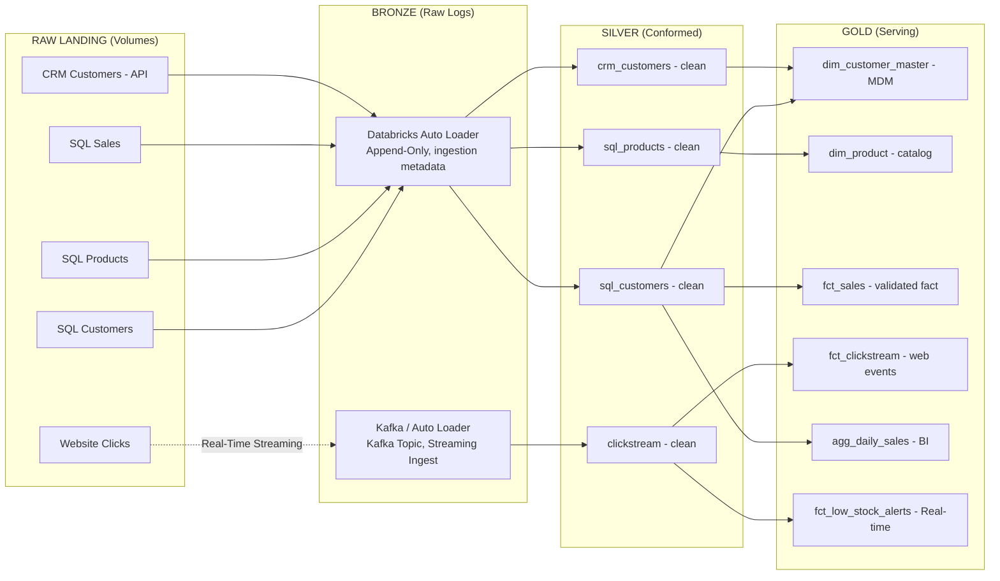

# NovaMart Retail Intelligence Lakehouse
An End-to-End Modern Data Platform built entirely on Databricks using Delta Lake, Unity Catalog, Databricks Asset Bundles (DABs), and automated testing.

---

## 1. Business Context & Objective
"NovaMart" is a retail enterprise operating across multiple global regions (including LATAM, APAC, EMEA, and North America). The company ingests raw data from three distinct sources:
- **On-prem SQL Server:** Transactional sales data and product catalogs.
- **SaaS CRM API:** Customer marketing profiles, loyalty tiers, and churn risk estimates.
- **Website Clickstream:** High-velocity event logs capturing user browse, search, and "add-to-cart" activities.

The objective of this platform is to build a highly optimized, audited, and secure Lakehouse that serves daily sales performance datamarts, customer behavioral profiles, and real-time inventory low-stock alerts.

---

## 2. Architecture & Data Flow
The platform is built entirely inside the Databricks Lakehouse, utilizing Databricks Workflows (Lakeflow Jobs) for orchestration, Auto Loader for streaming/batch ingestion, Delta Lake for storage, and Unity Catalog for centralized data governance.




---

## 3. Repository Structure
```
novamart-lakehouse/
├── databricks.yml                          # DAB bundle definition (Jobs & Targets as Code)
├── src/
│   ├── 00_setup_environment.ipynb
│   ├── bronze/
│   │   └── 00_ingest_raw_to_bronze.ipynb   # Parameterized Auto Loader helper
│   ├── silver/
│   │   ├── 01a_clean_sql_customers.ipynb
│   │   ├── 01b_clean_crm_customers.ipynb
│   │   ├── 01c_clean_sql_products.ipynb
│   │   ├── 01d_clean_sql_sale_transactions.ipynb
│   │   └── 01e_clean_clickstream.ipynb
│   ├── gold/
│   │   ├── 00_dim_customers.ipynb          # SQL + CRM Joined Master (MDM)
│   │   ├── 01_dim_products.ipynb           # Product Dim with Margins
│   │   ├── 02_fact_inventory.ipynb         # Inventory Fact
│   │   ├── 03_fact_sales.ipynb             # Validated Sales Fact
│   │   ├── 04_fact_clicks.ipynb


---

## 4. Key Design Decisions & Architectural Trade-offs

### Trade-off 1: Databricks Workflows over Azure Data Factory (ADF)
While ADF is standard for multi-system integrations, we executed orchestration natively inside Databricks Workflows (Lakeflow Jobs) defined as code in `databricks.yml`. This eliminated external API latency, avoided passing raw credentials across clouds, natively supported Unity Catalog lineage tracking, and allowed deployment as fully integrated Infrastructure-as-Code (IaC) using DABs.

### Trade-off 2: Rule-Based Acronym Standardization over Hardcoding
When cleaning region data (e.g., LATAM, APAC, EMEA vs. North America), we rejected hardcoded lists. Instead, we wrote a heuristic rule: *If the value is a single word and length is <= 5, it is automatically capitalized as an acronym; otherwise, it is converted to Title Case*. This ensures the pipeline is future-proof and accommodates new regions (e.g., MENA, ANZ, CIS) dynamically without code changes.

### Trade-off 3: Decoupling Security and Governance from Daily ETL Pipelines
In accordance with the **Least Privilege Principle**, the automated service accounts running daily data loads only have DML (read/write) access. They do not have permissions to run DDL commands (`ALTER TABLE`, `SET MASK`). Thus, we decoupled Unity Catalog security rules (Grants, PII Column Masking, and Row-Level Filters) into a separate, highly privileged notebook under `src/governance/` that is deployed only once during environment creation, protecting the lakehouse from accidental privilege escalations.

### Trade-off 4: Flexible Schema Testing over Strict StructTypes
For our 12 unit tests, we rejected verbose, hardcoded `StructType` definitions which are prone to false-positive failures during nullability or decimal scale mismatches. Instead, we passed a list of column names (`assert_cols`) to allow Spark Connect to infer types consistently from the mock data, and utilized `assertDataFrameEqual(..., ignoreNullable=True)` to focus strictly on data correctness rather than transient nullability metadata.

---

## 5. Deployment & Execution (Databricks Asset Bundles)

This project utilizes Databricks Asset Bundles (DABs) to configure, validate, and deploy resources.

### 1. Authenticate with your Workspace
Ensure your Databricks CLI is configured to use your target workspace:
```bash
databricks auth login --host https://dbc-0c7a6a9e-967f.cloud.databricks.com --profile DEFAULT

2. Validate the Bundle Configuration

Verify the syntax and integrity of the databricks.yml file:

databricks bundle validate

3. Deploy the Pipeline

Deploy the notebooks and configure the automated workflows:

# To Deploy to Development (Schedules are automatically paused)
databricks bundle deploy --target dev

# To Deploy to Production (Schedules are automatically activated)
databricks bundle deploy --target prod

6. Running the Unit Tests

Our test suite contains 12 highly optimized unit tests covering both
Silver-level formatting (e.g., E.164 phone formats, email syntax) and Gold-level
joins and financial aggregations (e.g., gross margin percentage and daily
revenue).

To run the unit tests inside Databricks, execute the final cell of the
tests/test_transformations.py notebook:

import pytest
# Executes all test functions prefixed with 'test_' in the notebook
pytest.main(["-v", "--tb=short", "-s"])

============================= test session starts ==============================
test_transformations.py::test_bronze_sql_customers_silver PASSED
test_transformations.py::test_bronze_crm_customers_silver PASSED
test_transformations.py::test_bronze_sql_products_silver PASSED
test_transformations.py::test_bronze_sql_sale_transactions PASSED
test_transformations.py::test_bronze_clickstream PASSED
test_transformations.py::test_transfer_silver_to_gold_dim_customer PASSED
test_transformations.py::test_transfer_silver_to_gold_dim_products PASSED
test_transformations.py::test_transfer_silver_to_gold_fact_inventory PASSED
test_transformations.py::test_transfer_silver_to_gold_fact_sales PASSED
test_transformations.py::test_transfer_silver_to_gold_fact_clicks PASSED
test_transformations.py::test_daily_sales PASSED
test_transformations.py::test_low_stock_alert PASSED
========================== 12 passed in 1.45s ==================================


---
